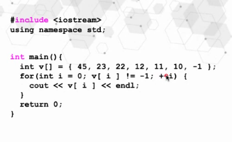
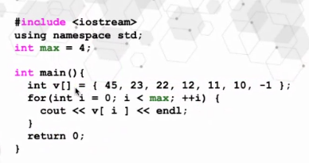
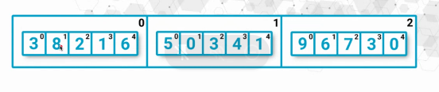
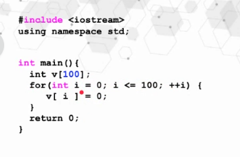
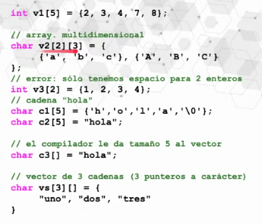

# IPOO
 👩‍💻Repository for my introduction to object-oriented programming class.  

#Tareas Pendientes:
- [x] Terminar ejercicios de Ingini
- [ ] Hacer los ejercicios de las diapositivas
- [x] Contar los números pares que existen entre un rango de valores

9/11/2020

## Estructuras de repetitivas.
    * While
    * Do-While
    * For

Se **repite** una instrucción hasta que se evalúa como **falsa**,
entonces se continúa con el algoritmo.

### While
->Evalúa la expresión de control al principio del ciclo,
y de nuevo al inicio de cada iteración.

Expresion de control repetitivo basado en los resultados de una expresión lógica.

Proposito: Repetir un bloque de cídog mientras una expresión de control se mantenga verdadera.

Ej:

``` C++
while (expresión de control){ // X <= 10

    ...
    Bloque de instrucciones si se cumple la condición
    (Siempre debe existir una instrucción en el cuerpo de while,
    que se haga falsa, de lo contrario se ejecutará "infinitamente")
    ....

}
```


...
Bloque de instrucciones
restante del algoritmo
...

### Do-While
->Es simple si se conoce while.

``` C++
do{
    ...
    Bloque de Instrucciones si se cumple la condición...
    ...
}while(expresión de control); //X<=10
...
Bloque de Instrucciones
restante del algoritmo
...
```


¿Cuando usamos Do-While? **Investigar**

### For

-> Estructura de control repetitivo en programación. En la cual se puede indicar el número máximo de iteraciones.

Ej:

``` C++
for(inicialización; condicion/control; incremento){
    ...
    Bloque de instrucciónes si se cumple la condición
    ...
}
...
Bloque de Instrucciones
restante Del algoritmo
...
```


La expresión de **inicialización** se ejecutara al principio del ciclo.

La expresión de **condición** se ejecutara al principio de cada iteración. Necesita ser true para que se ejecute.

Las expresiónes de **incremento** se ejecuta al finalizar cada iteración.

## Ejercicios

[Factorial](https://github.com/Ingrid-E/IPOO/tree/master/Factorial)

[Pairs](https://github.com/Ingrid-E/IPOO/tree/master/Pairs)

## Vectores/Arrays

Tipo de dato que permite contener/almacenar una seria de valores del mismo tipo.

-El tamaño es fijo
-No crece dinámicamente
-Similar a un vector, son la base para la construcción de vectores.

Son espacios contiguos en memoria, podemos acceder a sus elementos utilizando el nombre del vector, los corchetes y la posición.



**Centinela** Se utiliza para indicar el fin del vector.
En la imagen la centinela es el -1.



**Importante**
¿Que puedo almacenar en vector? **Booleanos, string, char, int, double,float**
¿Es lo mismo que un array/arreglo? **Si es lo mismo**



donde esta el 3?

vector[1][2] = 3

**Que puedo almacenar en vector?**

TIPO_DE_DATO NOMBRE_VARIABLE [TAMAÑO];

*Ej*
string vector[5] ={"5","hola","2.7","8,9","adios"}
        posicion =  0    1      2     3      4

*Ej 2*:

int vector2[]={1,2,3,4,5,67,23,10,10};  <--Array
*No se le definio el tamaño.

### Declaración de arreglos.

Crear o declarar un vector de tamaño cualquiera. 

``` C++ 

//Esto no se bebe hacer, si se declara asigno
int vectorx[3]; //Borrar esto
vectorx[3]={5,67,23};

``` 

``` C++ 

//Si utilizamos esto
int vectorx[3]; 
vectorx[0]= 5;
vectorx[1]= 67;
vectorx[2]= 23;

``` 



**i** llega maximo a 100. Porque cuando **i** == 101 porque ahi es cuando para

Este codigo da error 

si se pide la posición 100 da error, porque **el valor no existe en el arreglo.** 

v2[20][10] --> v2[filas][columnas]

Array - Vectores

*Un array tiene tamaño fijo, mientras un vector puede ir creciendo.

*En C++ toca pasar un array a un metodo.

*En C++ Se debe usar asignación, no hay forma conveniente para insertar elementos al inicia.

*En C++ no hay una forma convenientepara eliminar elementos en el arreglo.

*En C++ no se puede retornar un array desde una funcion,metodo. Toda utilizar **puntero o apuntadores**.




**Tipo de dato abstracto** es el de las clases.

Cuando usted declare un vector de elementos, llamara a el constructor cada vez.

##Vector de vectores